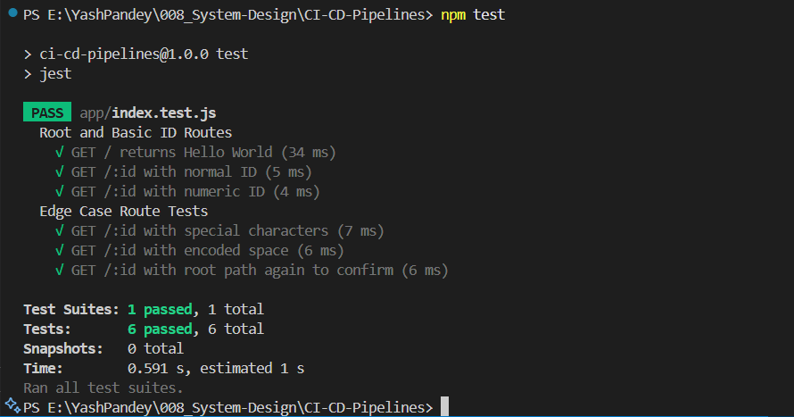
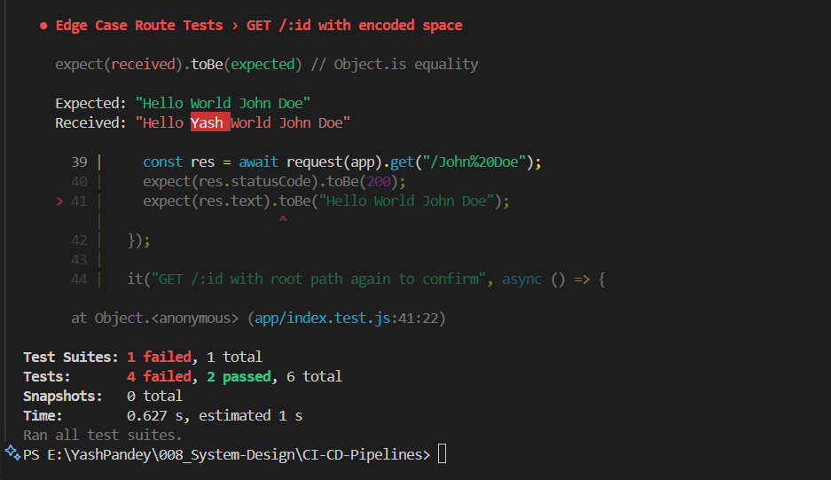

# ⚙️ CI/CD Pipeline with GitHub Actions & API Testing

A mini-project demonstrating **CI/CD pipeline implementation using GitHub Actions** and **automated API route testing** with **Jest** and **Supertest** for a Node.js Express application.

---

## 📌 What is CI/CD?

**CI/CD** stands for:

- **Continuous Integration (CI)** – Automatically test and build your app whenever you push code to the repository.
- **Continuous Deployment (CD)** – Automatically deploy the app when the tests pass, ensuring your latest code is always live.

These pipelines:

- Detect code changes (`git push`)
- Run test suites
- Deploy only on success
- Eliminate manual errors & reduce dev-ops overhead

---

## ⚙️ What are GitHub Actions?

**GitHub Actions** is an automation tool provided by GitHub. You can define custom workflows in `.yml` files to:

- Run tests
- Build and deploy code
- Trigger jobs based on events like commits or pull requests

This project uses a GitHub Action to:

1. Install dependencies
2. Run tests
3. Deploy via a Render deploy hook (only if all tests pass ✅)

---

## 🧪 What is Unit Testing using Jest & Supertest?

### **Jest**:

A JavaScript testing framework by Facebook for writing unit tests. It supports:

- Assertions (`expect(...)`)
- Mocks and spies
- Test runners

### **Supertest**:

A high-level abstraction to test HTTP endpoints. It simulates requests and checks responses without needing to deploy the server externally.

### 🔍 Example:

```js
it("GET / returns Hello World", async () => {
  const res = await request(app).get("/");
  expect(res.statusCode).toBe(200);
  expect(res.text).toBe("Hello World");
});
```

---

## 🚀 Project Overview

This mini-project includes:

- A simple Express server with two routes:

  - `/` → Returns `Hello World`
  - `/:id` → Returns `Hello World <id>`

- Test cases for both routes using **Jest** and **Supertest**
- A GitHub Actions workflow to automatically:

  - Install dependencies
  - Run tests
  - Deploy to Render (if tests pass)

---

## ✅ Correct Test Results

When the routes are implemented correctly, **all test cases pass** successfully:



---

## ❌ Failed Test Results

If any route is broken or missing, **relevant test cases fail**, ensuring reliability:



---

## 📁 Tech Stack

- **Node.js / Express**
- **Jest** for testing logic
- **Supertest** for endpoint testing
- **GitHub Actions** for CI/CD automation
- **Render** for deployment (via deploy hook)

---

## 🧠 Learning Outcomes

✅ Understand CI/CD and GitHub Actions
✅ Build & test Express routes
✅ Automate testing and deployment pipeline
✅ Visualize real test outcomes (pass vs fail)

---

## 🧑‍🎓 Author

**Made with 💻, ☕ and GitHub Actions** by [Yash Pandey](https://github.com/YashPandey-dev)
